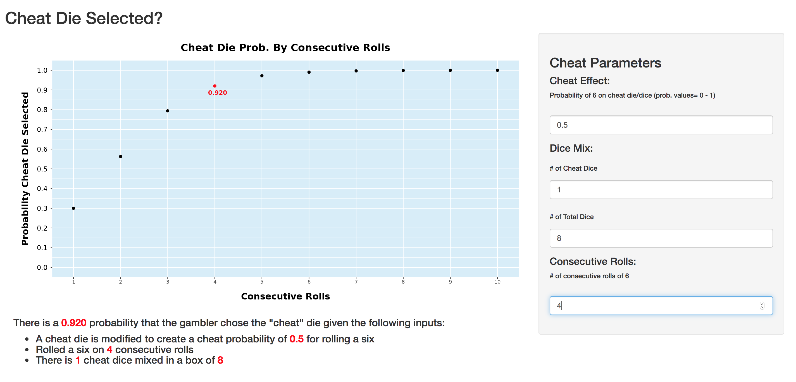

bayes_shiny.png

<!--https://collaboration133.com/how-to-scale-iframe-content-in-ie-chrome-firefox-and-safari/2717/-->

<iframe id="scaled-frame" src="https://apps.petedunham.com/shiny/Gambler_Roll/"></iframe>

<iframe src="https://apps.petedunham.com/shiny/Gambler_Roll/" style="border: 0px  width: 100%; height: 750px;"  ></iframe>

