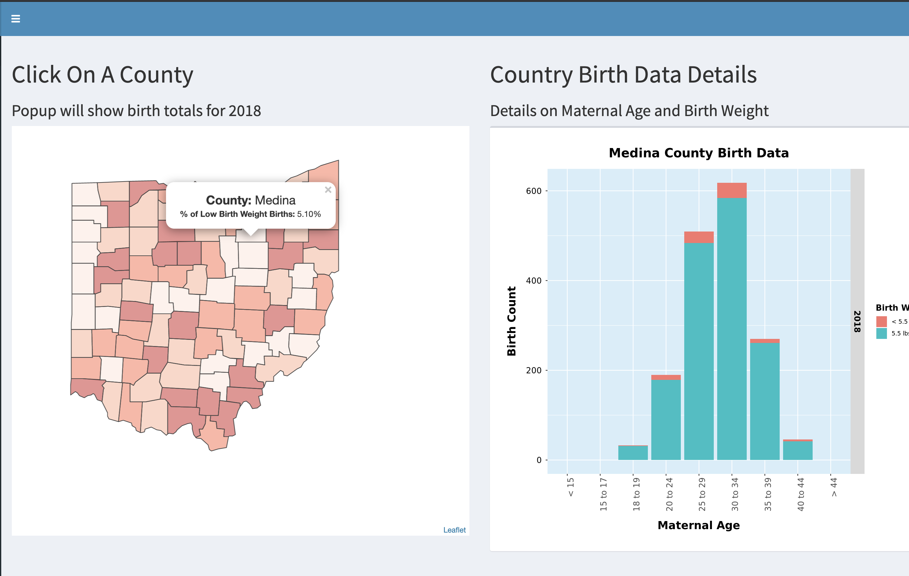

This post discusses using R/Shiny with Leaflet and shinydasbhoard package to make a click-able map. Graph views of data is updated based on the county clicked by the user. The map is prepped to display popup windows with details and the application updates various plots (ggplot2) based on the county selected.

I had previously built similar mapping type dashboard in Tableau and I wanted to see if same type of dashboard could be built using tools available in the R ecosystem (**hint:** they can!)

# Go To App:

The shinydashboard is best viewed and used in a full tab:
<left>
<div class="action">
        <a href="https://apps.petedunham.com/shiny/Interactive_Ohio_BirthData/" target="_blank" class="button is-primary">
                Click Here to Go to App
            </a>
      </div></left>

# Source Code:


            
              <h4>
              <a href="https://github.com/dunhampa/Interactive_Ohio_BirthData" target="_blank">
                <span class="icon"><i class="fa fa-github"></i></span>
                Source code on GitHub
              </a>
              </h4>
         



# Shiny Dashboard:

<a href="https://apps.petedunham.com/shiny/Interactive_Ohio_BirthData/"></a>

# Code

I wanted to document a couple of tricks I picked up along the way specifically related to interfacing to the [Leaflet](https://leafletjs.com/) (an open-source JavaScript library for mobile-friendly interactive maps).  

### Clickable Popup Windows (With Stats/Metrics)

The entire source code of the app is available [here](https://github.com/dunhampa/Interactive_Ohio_BirthData). The exert below shows how to add pop-ups windows to clickable section of the map. 


```{r setup, include=FALSE}
 map<-leaflet(SingleState,options = leafletOptions(zoomControl = FALSE, 
              zoomLevelFixed = TRUE, dragging=FALSE, minZoom = 7, maxZoom = 7) ) %>%
      
      addPolygons(color = "#444444", weight = 1, smoothFactor = 0.5,
                  opacity = 1.0, fillOpacity = 0.5,
                  layerId = ~NAME,
                  fillColor = ~colorQuantile("Reds",percent )(percent),
                  highlightOptions = highlightOptions(color = "white", weight = 2,
                                                      bringToFront = TRUE),
                  popup = ~as.factor(paste0("<b><font size=\"4\"><center>County: 
                          </b>",SingleState$NAME,"</font></center>",
                          "<b>% of Low Birth Weight Births: </b>", sprintf("%1.2f%%", 
                          100*SingleState$percent),"<br/>")))
    
    map<-map %>% setView(-82.1, 39.9,  zoom = 7)
  
    
    saveRDS(map, file="map.rds")


```

<style>

hljs-ln{
  color: maroon;
  margin-left: 40px;
}
</style>


### Update Plots and Graphics Based On User Click

The following code is an exert, see the complete source [here](https://github.com/dunhampa/Interactive_Ohio_BirthData).