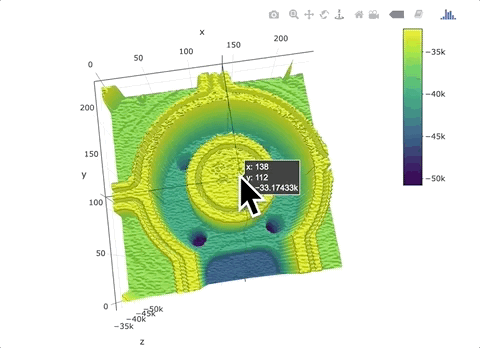

This post discusses how R and Plotly (graphing library) were used to create interactive 3D images of scanned objects (a semiconductor plate and a circuit board).

<center></center>

# Background 

As an R champion I've used the R ecosystem of open source packages to deliver rewarding data pipelines and  business insights. This aligns with how others talk about R, per Wikipedia as:



R is a programming language and free software environment for statistical computing and graphics supported by the R Foundation for Statistical Computing



However, there has been many times that R breaks out of the "data science" box in amazingly valuable and artist ways, because R's ecosystem has:

 - a enoromous breadth of available R packages
 - robust documentation for most packages
 - and support of an open R community 

# Example


# Code
```{r setup, include=FALSE}
  library(dplyr)
  library(akima)
  library(plotly)
  
  #Getting and scaling the 3D data
  #This a custom piece since data was 1 column stream
  #that just incremented x,y,and z information
  circuit_data<-read.csv("CircuitUniDirectionFlat.txt", header=FALSE)
  xseq<-seq(1,length(circuit_data[,1]),by=3)
  yseq<-seq(2,length(circuit_data[,1]),by=3)
  ainseq<-seq(3,length(circuit_data[,1]),by=3)
  x<-circuit_data[xseq,][1:129999]
  x<-x/50
  y<-circuit_data[yseq,][1:129999]
  y<-y/50
  z<-circuit_data[ainseq,][1:129999]
  z<-z/1
  z<-z*-1
  circuit_data<-data.frame(x,y,z)[1:127926,]
  data<-circuit_data
  
  #yop and xop determine resolution of surface plot
  # these are used as interp parameters
  xop<-as.matrix(seq(min(x), max(x), 200)) #100 here, worked well
  yop<-as.matrix(seq(min(y), max(y),200))
  
  data<-data.frame(x,y,z)
  circuitToPlot <- with(data,interp(x,y,z, yo=yop, xo=xop, duplicate="mean"))
  #with(circuitToPlot,image(x,y,z))
  
  plot_ly(z=circuitToPlot$z, type="surface")%>% 
    layout(
      scene = list(
        zaxis = list(range = c(-50000,-20000)),
        aspectratio = list(x = 1, y = .3, z = .1)
      )
    )
  ```


