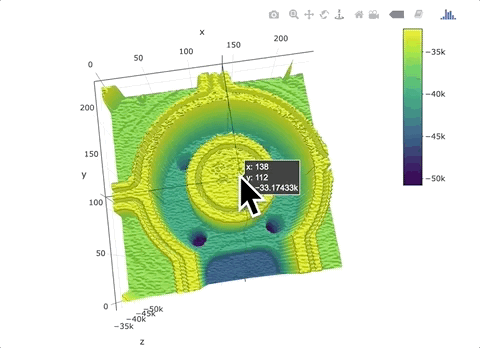
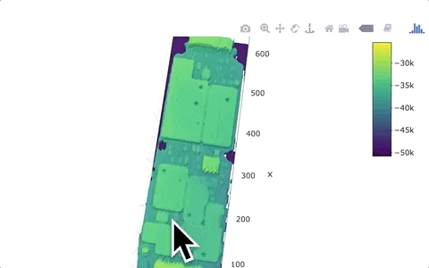

<center>
### Example 1:
</center>
<center></center>


R is widely known as a data science/statistical programming language. However with the breadth of available packages and diverse R community, I have found that R can break out of the data science box in amazingly powerful ways. 

For example, I was able to use R and [Plotly](https://plot.ly/) to create interactive 3D images of scanned objects. I had 3D scanning data from a motion system and used the R to create highly responsive 3D images that can be shared over the web!

The examples on this page are screen captures of interaction through the web. To interactive with these plots directly you can navigation to the interactive plots (which I host on GitHub) here:

[Click Here to Interact With The Plots](https://dunhampa.github.io/R_3D_Scanner_Plotting/)

<center>
### Example 2:
</center>
<center></center>

# Code

The trick for me was getting the 3 dimensional x,y,z into a format for a surface plot to render. This required finding a new package "akima" to use an interpolation function before sending Plolty. 

The source code with this trick can be found in this GitHub Repo:
            <a href="https://github.com/dunhampa/R_3D_Scanner_Plotting" title="R 3D Scanning Plotting">
              <span class="fa-stack fa-lg aria-hidden="true"">
                <i class="fa fa-circle fa-stack-2x aria-hidden="true""></i>
                <i class="fa fa-github fa-stack-1x fa-inverse aria-hidden="true""></i>
              </span>
            </a>


The R code exert, below,  shows the prep of x,y,and z data to surface data for rendering using [Plotly](https://plot.ly/r/3d-surface-plots/).

```{r setup, include=FALSE}
  library(dplyr)
  library(akima)
  library(plotly)
  
  #Getting and scaling the 3D data
  #This a custom piece since data was 1 column stream
  #that just incremented x,y,and z information
  circuit_data<-read.csv("CircuitUniDirectionFlat.txt", header=FALSE)
  xseq<-seq(1,length(circuit_data[,1]),by=3)
  yseq<-seq(2,length(circuit_data[,1]),by=3)
  ainseq<-seq(3,length(circuit_data[,1]),by=3)
  x<-circuit_data[xseq,][1:129999]
  x<-x/50
  y<-circuit_data[yseq,][1:129999]
  y<-y/50
  z<-circuit_data[ainseq,][1:129999]
  z<-z/1
  z<-z*-1
  circuit_data<-data.frame(x,y,z)[1:127926,]
  data<-circuit_data
  
  #yop and xop determine resolution of surface plot
  # these are used as interp parameters
  xop<-as.matrix(seq(min(x), max(x), 200)) #100 here, worked well
  yop<-as.matrix(seq(min(y), max(y),200))
  
  data<-data.frame(x,y,z)
  circuitToPlot <- with(data,interp(x,y,z, yo=yop, xo=xop, duplicate="mean"))
 
  
  plot_ly(z=circuitToPlot$z, type="surface")%>% 
    layout(
      scene = list(
        zaxis = list(range = c(-50000,-20000)),
        aspectratio = list(x = 1, y = .3, z = .1)
      )
    )
  ```


